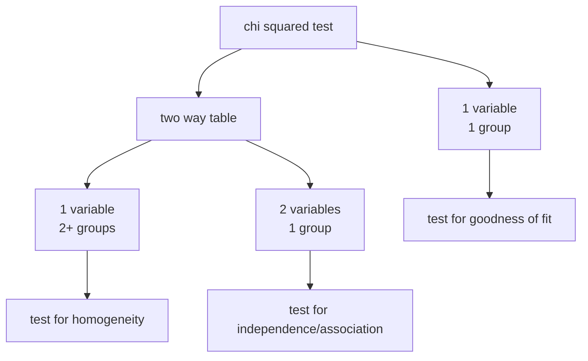

# **terms**
### standard error
- standard error is represents how much a sample parameter is likely to deviate from the true population parameter
### standard deviation
- only applies to a normal distribution
- how much, on average does the data vary from the mean
- the standard deviation is the standard error of a normal distribution
### random sampling
- sample is random selected from the population
### 10% rule
- rule for independence
- sample size is no more than 10% of the population the sample is derived from
### central limit theorem
- only applies to sampling distributions for the mean
- sample size must be greater than or equal to 30
# intervals and tests
Use an interval when the question asks for *how much different* or an *estimation*, and use test for when the question asks for *yes or no answer*.
## intervals
1. calculate standard error
2. calculate adjustment value
	- for proportions, take the confidence level and plug it into a z-score calculator for a normal distribution ($\mu=0$, $\sigma=1$). $z^* = \text{z-score}$
	- for means, take the confidence level and plug it into a t-distribution calculator with the appropriate degrees of freedom. $t^* = \text{t-value}$
3. margin of error is adjustment value times the standard error
4. interval is the mean $\pm$ margin of error
#### Type I error
- accepting $H_a$ as true, when it is false (AKA false positive)
- alternatively rejecting $H_0$ as false, when it is true
- the probability of a Type I error is the same as the alpha ($\alpha$) value
#### Type II error
- accepting $H_a$ as false, when it is true (AKA false negative)
- alternatively accepting $H_0$ as true, when it is false
- the probability of a Type II error is the same as the beta ($\beta$) value
#### Power
- the power of a test is the probability of rejecting $H_0$ when it is false
- rephrased: the power of the test is the probability of correctly accepting $H_a$
- the power of a test is equal to $1-\beta$
###### Ways to increase power
1. increasing sample size (indirectly decreases standard error)
2. increasing effect size
> difference between the true population parameter and your sample parameter
3. decreasing standard error
4. increase alpha
> $\alpha$ and $\beta$ are related. That is an increase in $\alpha$ means an decrease in $\beta$, and vice versa. However $\alpha + \beta$ does not necessarily equal 1. Since power is defined as $1-\beta$, an increase in alpha causes a decrease in $\beta$ and an increase in power.
## tests
1. calculator standard error
2. calculate test statistic $\frac{\text{mean}}{\text{standard error}}$
3. calculate p-value
	- for proportions, plug into normal distribution
	- for means, plug into t-distribution
	- remember *Use central area for difference, right tail for greater than, left tail for less than.*
## 1 sample t interval for population mean
### use case
- sample size is less than 30
- population standard deviation is unknown
### conditions
- data must be random ([[#random sampling]])
- data must be independent ([[#10% rule]])
	- does not apply when sample is not a random sample using random assignment
- data must be normal
	- meet the [[#central limit theorem]]
	- already be normal
	- data has no outliers and is not crazy
### calculations
$s = \text{standard deviation of sampling distribution}$
$stderr = \frac{s}{\sqrt n}$
$t^* = (\text{find from table B, with df} = n - 1, \text{confidence level} = 1.0 - \alpha)$
> $t^*$ is required to adjust the standard error calculation, since we are using the *sample* standard deviation instead of the *population* standard deviation. $df$ stands for *degrees of freedom*.
> Stapplet/calculator can also be used to calculate $t^*$.

$\overline x \pm t^* \cdot stderr$
## 1 sample t test for population mean
### use case
- see [[#1 sample t interval for population mean#use case]]
### conditions
- see [[#1 sample t interval for population mean#conditions]]
### calculations
$\overline x = \text{sample mean}$
$s = \text{standard deviation of the sample}$
$t = (\overline x - \mu_0) \cdot \frac{\sqrt n}{s}$
$\text{p-value} = (\text{T distribution})(t, \text{degrees of freedom} = n - 1, \text{confidence level = ?})$
> Use central area for difference, right tail for greater than, left tail for less than.

> A matched pairs difference experiment can be decomposed into a 1 sample t test for population mean with $\mu_0 = 0$.

# chi squared test

## test for goodness of fit
Testing the distribution of proportions for a single categorical variable against the expected proportions (e.g. a six sided dice).
## test for homogeneity
Used to compare distributions from a random sample or randomized experiment, with a single categorical variable but multiple groups.
## test for independence/association
Test to see if two different categorical variables are associated.